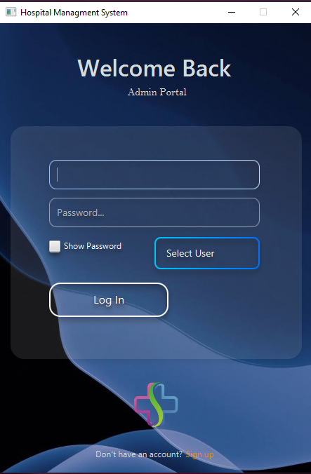
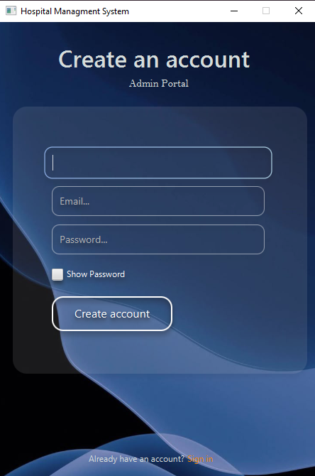
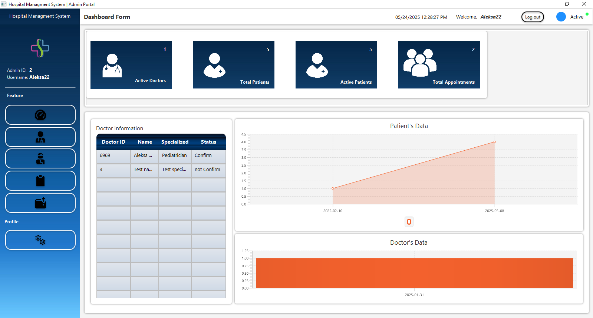

<h1 style="font-size: 36px; text-align: center; margin: 0;">Hospital Managment System</h1>


A full-featured Java-based Hospital Management System that helps clinics and hospitals manage patients, doctors, and appointments with ease. The application is built using **Java**, **JavaFX**, and **MySQL** with support for user authentication, CRUD operations, and role-based access.

---

## 📑 Table of Contents

- [Features](#Features)
- [Screenshots](#screenshots)
- [Tech Stack](#tech-stack)
- [Usage](#usage)
- [License](#license)
- [About Me](#about-me)
- [Installation](#installation)
---

## Features

- 👨‍⚕️ Doctor and Patient Management (Add, Edit, Delete)
- 📅 Appointment Scheduling
- 🔐 Authentication & Role Management
- 📊 Dashboard with statistics
- 💾 Data persistence using MySQL
- 🖨️ Export & Print reports (JasperReports)
- 📁 Clean codebase with MVC structure

---

## Screenshots

### Admin
<p align="center">
  
  
  
</p>


---

## Tech Stack

- **Java 17+**
- **JavaFX**
- **MySQL**
- **SceneBuilder** (for UI)
- **JasperReports** (for report generation)
- **Maven** (for dependency management)

---

## Usage

- Login with credentials (admin/doctor)
- Navigate through dashboard to manage doctors, patients, and appointments
- Use the print button to generate reports via JasperReports

## License

This project is open-source and available under the MIT License.

## About Me

I'm a Computer and Software Engineering student from Serbia, currently focused on building my portfolio and growing as a backend developer.

I'm passionate about software architecture, clean code, and scalable system design. I enjoy working with technologies like Java, Spring Boot, MySQL, and RESTful APIs. I'm also comfortable with Git for version control, and I constantly aim to improve my understanding of algorithms and system design patterns.

Beyond tech, I’m a person with wide interests, always open to meeting new people and building meaningful connections — both in tech and beyond.

## Installation

```bash
# Clone the repository
git clone https://github.com/Al3k5a24/hospital-management-system.git

# Navigate into the project directory
cd hospital-management-system

# Open the project in your IDE (IntelliJ, Eclipse, or VS Code)

# Setup MySQL Database
# - Create a database (e.g. hospital_db)
# - Import SQL schema (if provided)
# - Update DB credentials in application.properties or Java config

# Build and run the app
mvn clean install
